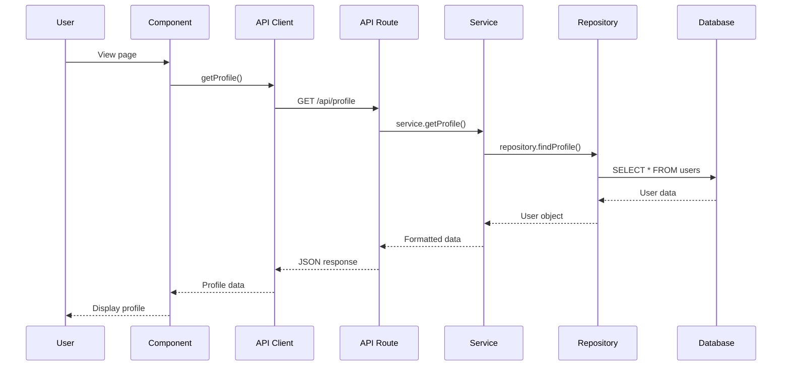
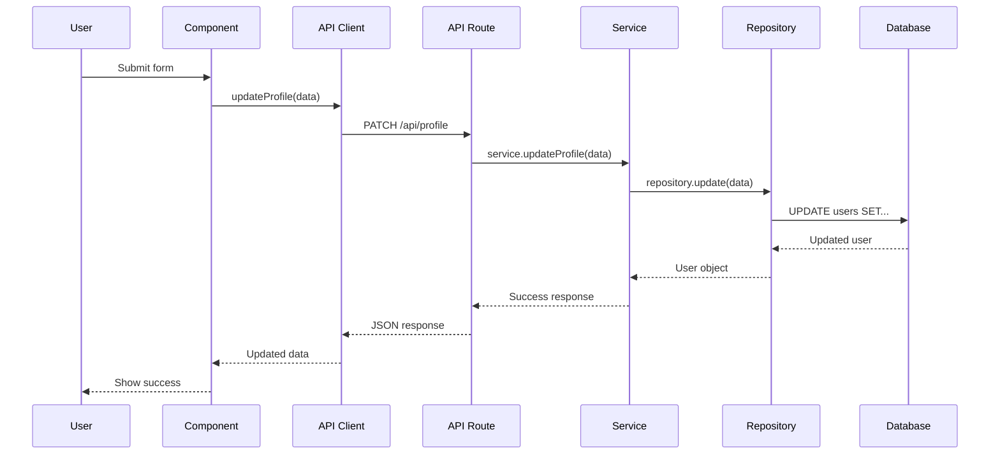

# Data Flow

Understanding how data flows through the application.

## Overview

Our application follows a unidirectional data flow pattern:

```
User Action → Event Handler → API Call → Service → Repository → Database
                                                                     ↓
User Interface ← Component Update ← State Update ← API Response ←───┘
```

## Data Flow Patterns

### 1. Read Flow (Fetching Data)



### 2. Write Flow (Updating Data)



## State Management

### Server State

Data fetched from the backend:

```tsx
"use client";

import { useState, useEffect } from "react";
import { getProfile } from "@/lib/api/profile";

export function ProfileComponent() {
  const [profile, setProfile] = useState(null);
  const [loading, setLoading] = useState(true);
  const [error, setError] = useState(null);

  useEffect(() => {
    getProfile()
      .then(setProfile)
      .catch(setError)
      .finally(() => setLoading(false));
  }, []);

  if (loading) return <div>Loading...</div>;
  if (error) return <div>Error: {error.message}</div>;
  if (!profile) return <div>No profile found</div>;

  return <div>{profile.name}</div>;
}
```

### Client State

UI state managed locally:

```tsx
"use client";

import { useState } from "react";
import { Button } from "@uwdsc/ui";

export function Counter() {
  const [count, setCount] = useState(0);

  return (
    <div>
      <p>Count: {count}</p>
      <Button onClick={() => setCount(count + 1)}>Increment</Button>
    </div>
  );
}
```

### Context State

Shared state across components:

```tsx
"use client";

import { createContext, useContext, useState } from "react";

const AuthContext = createContext(null);

export function AuthProvider({ children }) {
  const [user, setUser] = useState(null);

  return (
    <AuthContext.Provider value={{ user, setUser }}>
      {children}
    </AuthContext.Provider>
  );
}

export function useAuth() {
  return useContext(AuthContext);
}
```

## Data Fetching Patterns

### 1. Server Components (Recommended)

Fetch data directly in server components:

```tsx
// app/profile/page.tsx
import { ProfileCard } from "@/components/ProfileCard";

async function getProfile() {
  const response = await fetch("http://localhost:3000/api/profile", {
    cache: "no-store", // or 'force-cache' for caching
  });
  return response.json();
}

export default async function ProfilePage() {
  const profile = await getProfile();

  return <ProfileCard profile={profile} />;
}
```

**Benefits:**

- No loading state needed
- No client-side JavaScript for data fetching
- Better SEO
- Automatic error boundaries

### 2. Client Components with useEffect

For interactive components:

```tsx
"use client";

import { useState, useEffect } from "react";
import { getProfile } from "@/lib/api/profile";

export function ProfileCard() {
  const [profile, setProfile] = useState(null);

  useEffect(() => {
    getProfile().then(setProfile);
  }, []);

  return profile ? <div>{profile.name}</div> : <div>Loading...</div>;
}
```

### 3. React Query / SWR (Advanced)

For caching and revalidation:

```tsx
"use client";

import useSWR from "swr";
import { getProfile } from "@/lib/api/profile";

export function ProfileCard() {
  const {
    data: profile,
    error,
    isLoading,
  } = useSWR("/api/profile", getProfile, {
    revalidateOnFocus: false,
    revalidateOnReconnect: true,
  });

  if (isLoading) return <div>Loading...</div>;
  if (error) return <div>Error</div>;

  return <div>{profile.name}</div>;
}
```

## Form Submission Flow

### Complete Form Example

```tsx
"use client";

import { useState } from "react";
import { useForm } from "react-hook-form";
import { zodResolver } from "@hookform/resolvers/zod";
import { updateProfile } from "@/lib/api/profile";
import { updateProfileSchema } from "@/lib/schemas/profile";
import { Button, Input } from "@uwdsc/ui";

export function ProfileForm({ initialData }) {
  const [isSubmitting, setIsSubmitting] = useState(false);
  const [message, setMessage] = useState("");

  const {
    register,
    handleSubmit,
    formState: { errors },
  } = useForm({
    resolver: zodResolver(updateProfileSchema),
    defaultValues: initialData,
  });

  const onSubmit = async (data) => {
    setIsSubmitting(true);
    setMessage("");

    try {
      const result = await updateProfile(data);
      setMessage(result.message);
    } catch (error) {
      setMessage(`Error: ${error.message}`);
    } finally {
      setIsSubmitting(false);
    }
  };

  return (
    <form onSubmit={handleSubmit(onSubmit)}>
      <div>
        <Input
          {...register("name")}
          placeholder="Name"
          disabled={isSubmitting}
        />
        {errors.name && <p className="text-red-500">{errors.name.message}</p>}
      </div>

      <Button type="submit" disabled={isSubmitting}>
        {isSubmitting ? "Saving..." : "Save"}
      </Button>

      {message && <p>{message}</p>}
    </form>
  );
}
```

## Error Handling

### Complete Error Flow

```tsx
// Client API
export async function getProfile() {
  try {
    const response = await fetch("/api/profile");

    if (!response.ok) {
      const error = await response.json();
      throw new Error(error.message || "Failed to fetch profile");
    }

    return response.json();
  } catch (error) {
    console.error("API Error:", error);
    throw error;
  }
}

// Component
("use client");

export function ProfileCard() {
  const [profile, setProfile] = useState(null);
  const [error, setError] = useState(null);

  useEffect(() => {
    getProfile().then(setProfile).catch(setError);
  }, []);

  if (error) {
    return (
      <div className="bg-red-100 p-4 rounded">
        <h3>Error</h3>
        <p>{error.message}</p>
      </div>
    );
  }

  return profile ? <div>{profile.name}</div> : <div>Loading...</div>;
}
```

## Optimistic Updates

Update UI before server confirms:

```tsx
"use client";

import { useState } from "react";
import { updateProfile } from "@/lib/api/profile";

export function ProfileEditor({ initialProfile }) {
  const [profile, setProfile] = useState(initialProfile);

  const handleUpdate = async (newName) => {
    // Optimistic update
    const previousProfile = profile;
    setProfile({ ...profile, name: newName });

    try {
      await updateProfile({ name: newName });
    } catch (error) {
      // Rollback on error
      setProfile(previousProfile);
      alert("Update failed");
    }
  };

  return <div>{profile.name}</div>;
}
```

## Data Validation Flow

```
User Input → Client Validation → API Request → Server Validation → Database
```

### Client-Side Validation

```tsx
import { z } from "zod";

const schema = z.object({
  email: z.string().email(),
  age: z.number().min(18),
});

// Validates before API call
const validated = schema.parse(formData);
```

### Server-Side Validation

```tsx
// Always validate on server
export async function POST(request: Request) {
  const body = await request.json();
  const validated = schema.parse(body); // Throws if invalid
  // Process validated data
}
```

## Best Practices

### ✅ Do

- Use server components when possible
- Validate on both client and server
- Handle loading and error states
- Use optimistic updates for better UX

### ❌ Don't

- Skip server-side validation
- Fetch data in multiple places
- Ignore error handling
- Over-fetch data
- Expose sensitive data to client

## Next Steps

- [API Architecture](/architecture/api-flow) - Backend patterns
- [Creating API Endpoints](/guides/creating-api) - Build APIs
