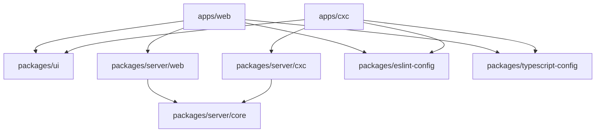

# Architecture Overview

Our monorepo is built on modern web technologies with a focus on code reuse, type safety, and developer experience.

## Tech Stack

### Frontend
- **Framework**: Next.js 15 (App Router)
- **UI Library**: React 19
- **Language**: TypeScript 5.7
- **Styling**: Tailwind CSS
- **Component Library**: shadcn/ui (Radix UI primitives)
- **Animation**: Framer Motion
- **Forms**: React Hook Form + Zod validation

### Backend
- **Database**: PostgreSQL (via Supabase)
- **Database Client**: pg (node-postgres) with raw SQL
- **Migrations**: db-mate with SQL files
- **Auth**: Supabase Auth
- **Storage**: Supabase Storage
- **API**: Next.js API Routes

### Monorepo Tooling
- **Package Manager**: pnpm (with workspaces)
- **Build System**: Turborepo
- **Code Quality**: ESLint, Prettier, TypeScript

## Architecture Principles

### 1. **Atomic Design System**

We follow atomic design principles:

```
Atoms (packages/ui) → Molecules (app components) → Organisms → Pages
```

- **Atoms**: Basic UI components (Button, Card, Input)
- **Molecules**: Composed components with specific functionality
- **Organisms**: Complex UI sections
- **Pages**: Full page layouts

### 2. **Layered Architecture**

Clean separation of concerns:

```
React Components → Client API → API Routes → Services → Repository → Database
```

Each layer has a specific responsibility:
- **Components**: UI and user interaction
- **Client API**: Type-safe API wrappers
- **API Routes**: HTTP request handling
- **Services**: Business logic
- **Repository**: Data access layer
- **Database**: Data persistence

### 3. **Shared-First Approach**

Common functionality lives in shared packages:
- **UI components** in `packages/ui`
- **Backend utilities** in `packages/server/core`
- **Config** in `packages/eslint-config` and `packages/typescript-config`

### 4. **Type Safety Everywhere**

- TypeScript across the entire stack
- Zod schemas for runtime validation
- pg with raw SQL queries for database access
- Shared types between frontend and backend

## Package Organization

### Apps (`apps/`)

Frontend applications that users interact with:

```
apps/
├── web/          # Main UWDSC website
├── cxc/          # CXC AI hackathon app
└── docs/         # This documentation site
```

### Shared Packages (`packages/`)

Reusable code shared across apps:

```
packages/
├── ui/                    # Design system (atoms)
├── server/                # Backend services
│   ├── core/             # Shared backend utilities
│   ├── web/              # Web app backend
│   └── cxc/              # CxC app backend
├── eslint-config/         # Shared ESLint config
└── typescript-config/     # Shared TypeScript config
```

## Dependency Flow



Apps depend on packages, but packages never depend on apps. This ensures:
- Clear dependency direction
- Packages can be used independently
- No circular dependencies

## Build Process

Turborepo orchestrates the build process:

1. **Dependency Graph**: Turborepo analyzes dependencies
2. **Topological Ordering**: Builds packages in correct order
3. **Parallel Execution**: Runs independent tasks in parallel
4. **Caching**: Skips unchanged packages

```bash
# Build all packages in optimal order
pnpm build

# Turborepo handles:
# 1. Building packages/ui first
# 2. Building server packages
# 3. Building apps last
```

## Development Workflow

```bash
# 1. Make changes to any package
# 2. Turborepo detects changes
# 3. Only affected packages rebuild
# 4. Hot module replacement in apps
```

## Next Steps

- [Monorepo Structure](/architecture/monorepo) - Detailed package breakdown
- [Design System](/architecture/design-system) - UI component architecture
- [API Architecture](/architecture/api-flow) - Backend patterns

